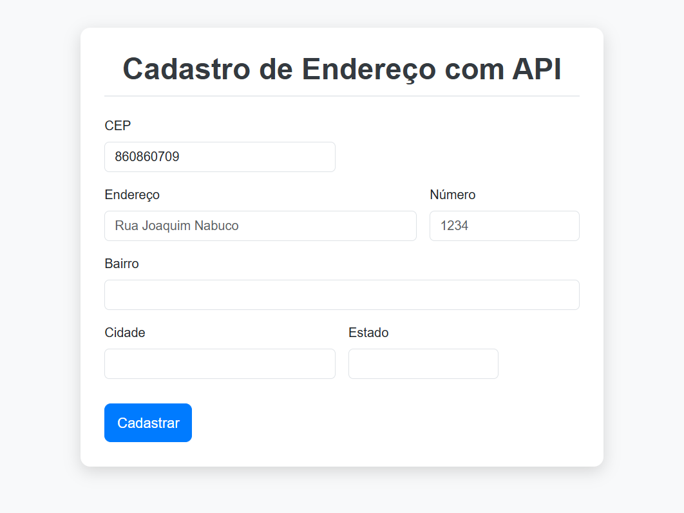
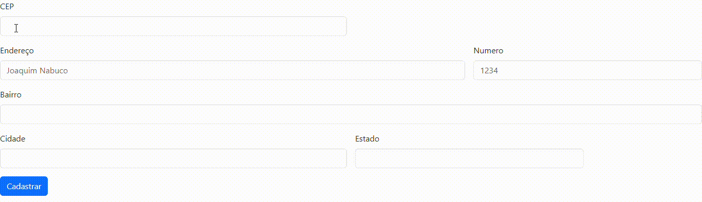
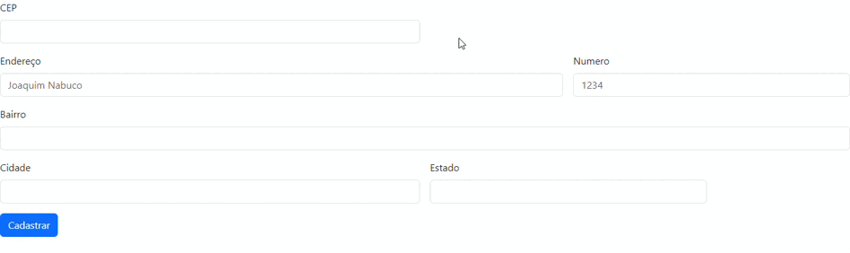
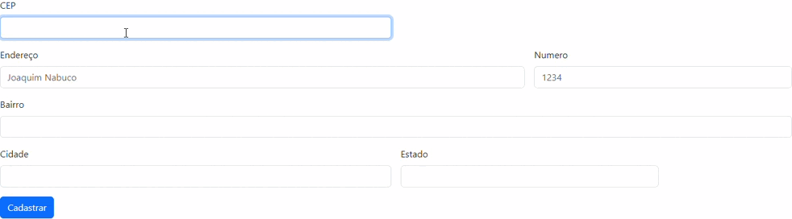

# projeto-Cad-Endereco 📦

## 📋 Descrição do Projeto

Este projeto demonstra a integração de **Frontend** e **API** para automatizar o preenchimento de formulários de endereço. Utiliza o **Fetch API assíncrono** (`async/await`) para buscar dados do CEP na ViaCEP, garantindo uma experiência de usuário **rápida**, **precisa** e prevenindo a submissão de formulário inadequada.

**Objetivo:** Reduzir erros de digitação e melhorar a qualidade dos dados de cadastro.

---

## ⚙️ Arquitetura e Competências

Esta aplicação foca em demonstrar competências essenciais de desenvolvimento Web:

* **Validação de Dados:** Uso de Expressões Regulares (`RegEx`) para garantir que o formato do CEP seja válido antes de consumir a API.
* **Consumo de API:** Utilização da função assíncrona (`async`/`await` com `fetch`) para buscar dados em segundo plano, sem travar a interface.
* **Manipulação do DOM:** Uso do método `addEventListener()` para capturar eventos de usuário (`focusout`, `submit`) e atualizar o formulário dinamicamente.
* **Tratamento de Erros:** Implementação de lógica para tratar CEPs não encontrados (`address.hasOwnProperty('erro')`) e outros erros de requisição.
* **UX/Formulários:** Prevenção do comportamento padrão de submissão de formulário (`e.preventDefault()`) para evitar recarregamento de página.

### Estrutura de Código

* **HTML/Bootstrap:** Responsividade e estrutura de layout (Sistema Grid).
* **Controller.js:** Toda a lógica de requisição, validação e manipulação do DOM.

---

## ✨ Demonstração e Experiência do Usuário
 

O sistema oferece feedback instantâneo ao usuário:

### 1. Preenchimento Automático
Ao digitar um CEP válido e sair do campo, o formulário é preenchido em tempo real.
 

### 2. Tratamento de Erros
O sistema valida o formato do CEP e alerta o usuário se o CEP for inválido ou não for encontrado.
 
 

---

## 🛠️ Tecnologias Utilizadas
* **Linguagens:** HTML5, CSS3, JavaScript (ES6+)
* **Frameworks/Bibliotecas:** Bootstrap 5
* **API:** ViaCEP (Utilizada para consulta de endereços)

## 🖇️ Fontes Consultadas
[Bootstrap](https://getbootstrap.com/docs/5.0/forms/layout/#gutters)  
[Developer Mozilla (RegEx e Fetch)](https://developer.mozilla.org/pt-BR/docs/Web/JavaScript/Guide/Regular_expressions)

## ✒️ Autores  
| | [ Larissa Manrique](https://github.com/larissassk) | [ Emilly Caroline ](https://github.com/emillycaaroline) | [ Amanda Vitória](https://github.com/amandvitoria) | [ Leonardo Rocha ](https://github.com/LeonardoRochaMarista) |  
| :---: | :---: | :---: | :---: | :---: |